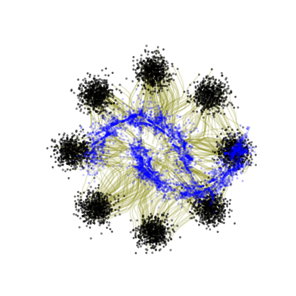
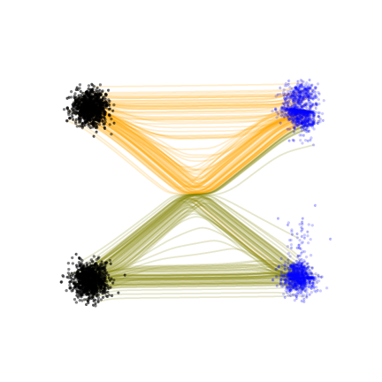

# JAXFM : A Python package for Flow Matching using JAX
 

## Description
A Python package implementing flow matching methods using jax. The code includes 
- `reflows.py` : Implementation of [1] 
- `conditional.py`: Implementation of [2]
Various test datasets are also available to test the above methods.

## Refrences

[1]: [(Liu et al.)](http://arxiv.org/abs/2209.03003) **Flow Straight and Fast: Learning to Generate and Transfer Data with Rectified Flow** 

[2]: [(Lipman et al.)](http://arxiv.org/abs/2210.02747) **Flow Matching for Generative Modeling**
